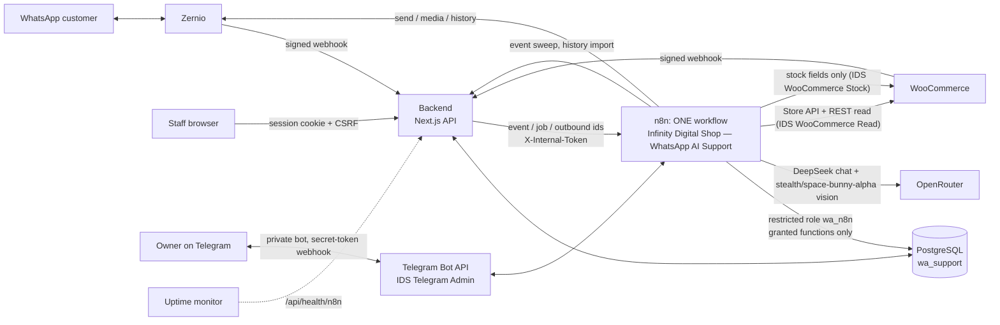

# Architecture

## Components

- **Backend (Next.js, `src/`).**
  - Receives the Zernio and WooCommerce webhooks and verifies their HMAC over the raw body.
  - Stores the event durably, acknowledges it, then applies it in one transaction:
    - customer identity;
    - the message;
    - duplicate detection;
    - origin detection for outgoing echoes;
    - human-request detection and the resulting takeover.
  - Serves the dashboard and its authenticated API. Every staff action goes through a capability check (`src/lib/permissions.ts`), and the database checks it again (`app.require_cap`).
- **PostgreSQL (`db/`).** Schema `app` holds everything: conversations, messages, the outbox, AI jobs, drafts, knowledge, memories, order requests, alerts, audit, metrics and settings. The control rules are SQL functions, for example:
  - `claim_event_route`
  - `start_ai_job`
  - `submit_ai_result`
  - `claim_outbound`
  - `record_send_result`
  - `take_over`
  - `set_global_controls`

  Because the rules live in the database, the backend and n8n cannot disagree about them.
- **n8n: exactly one workflow**, *Infinity Digital Shop — WhatsApp AI Support*.
  - It has no sub-workflows, no Execute Workflow or workflow-tool nodes, no separate error workflow, and no calls to its own webhooks.
  - It connects to PostgreSQL as `wa_n8n`, which may only execute the functions listed in `db/grants.sql`.
  - It holds the provider credentials (all named `IDS …`, used by no other project).

## The workflow

The workflow is generated from `n8n/workflow.mjs`. Code nodes come from `n8n/code/src`, and the importable file is `n8n/workflow/ids-whatsapp-ai-support.json`. On the canvas, each section below is a labelled band with a note.

| # | Section | Entry | What it does |
| --- | --- | --- | --- |
| 1 | Event intake & routing | webhook `wa-router` | Claims the stored event **once** (`claim_event_route`), so a re-delivery stops at *Valid?*. Downloads media first, then routes on the stored decision plus the conversation's **current** mode: AI reply, handoff acknowledgement, staff alert |
| 2 | Customer media download | from 1 or 12 | Zernio's authenticated media endpoint only (`https://zernio.com/api/v1/…`, checked strictly). Type and size are checked; all results are stored in one database call |
| 3 | AI reply (DeepSeek) | from 1; webhook `wa-ai-job` for staff assist / sandbox | Burst debounce, `start_ai_job`, scoped redacted context, up to 3 model rounds plus 1 repair, server-side validation, `submit_ai_result` |
| 4 | AI tool calls | loops from 3 | One tool call per loop iteration. Arguments are re-validated. *Tool Return* sends each result back to its round |
| 5 | Image analysis (vision model) | from 4 | The customer's stored attachment is sent as a base64 data URL with the question. Output is validated JSON observations; stale jobs are skipped; results are reused for the same image, model and prompt |
| 6 | WooCommerce tools | from 4 | Store API search, details and variations; hosted-checkout links; order status **only for a verified owner**; staff-handled order requests |
| 7 | Outgoing dispatch | webhook `wa-dispatch`, every 15 s, and from 1, 3, 9, 12 | **The only sending path.** A queue and a loop; `claim_outbound` re-checks every control right before each send; Idempotency-Key; unknown outcomes are recorded, never retried blindly |
| 8 | Notifications | database outbox, every 1 min; 21:00 daily summary | Business events (new chats, handoffs, delivery failures, orders, stock, knowledge, expiring notices, API/connection/spending/deployment/backup problems, status of Telegram replies) become rows in `app.admin_notifications`. Each category is immediate, summary or disabled; rows are deduplicated, rate-limited and sent only to paired admins; a failed Telegram send is retried at most 3 times and never repeats the action behind it |
| 9 | WooCommerce sync | webhook `wa-woo-event`, every 6 h | Product and order references; optional order-status messages through 7 |
| 10 | Memory & summaries | every 10 min, looped | Per-conversation summaries and customer-stated preferences, scoped to that customer |
| 11 | Daily knowledge proposals | 03:15 Asia/Dhaka | Redacted review of resolved chats. Produces **pending** proposals only; an admin must approve them |
| 12 | Recovery & maintenance | every 1 min / 5 min / daily | Heartbeat, lease expiry, backend event sweep, interrupted-job recovery, overdue reminders, pending media, unknown-send reconciliation, expiring-notice warnings, stuck stock changes, retention |
| 13 | History import | manual | Earlier Zernio history for known conversations, stored as historical messages (never answered) |
| 14 | Error recording | Error Trigger (the workflow is its own error workflow) | A failure becomes a dashboard alert and an `api_failure` notification |
| 15 | Connection check | manual | Read-only live check of every credential and service |
| T1 | Telegram admin: intake & authorization | Telegram Trigger (`IDS Telegram Admin`) | n8n checks Telegram's secret-token header. `telegram_accept_update` records each `update_id` once and authorizes by **numeric user id + private chat id** of a paired owner/admin, before anything else runs. Pairing with a single-use 10-minute code |
| T2 | Telegram admin: command understanding | from T1 | Explicit forms by rules; other wording (English, Bangla, Banglish) to DeepSeek, which may only **propose** one structured action. *Check Proposed Action* validates it; `admin_command_start` records it once and checks the role for that action type |
| T3 | Telegram admin: stock | from T2 | Exact product/variation (choices when ambiguous) → current values → plan (set / add-remove / availability, respecting *Manage stock*) → `stock_change_begin` (records previous, blocks overlap) → PUT of one stock field with `IDS WooCommerce Stock` → read-back → succeeded / failed / **unknown** |
| T4 | Telegram admin: knowledge, notices, notes, WhatsApp replies | from T2 | Permanent knowledge, temporary notices (scope, start, expiry in Asia/Dhaka, version), private staff notes, and exact-text WhatsApp replies queued as human staff replies through section 7 |

**How one workflow replaces the old sub-workflow calls.**
- Where the old design called a sub-workflow once per item, a **Loop Over Items** node (batch size 1) walks the items through the shared branch, and every path returns to the loop. There are loops for tool calls (one per round), dispatch, summaries, reconciliation and history import.
- Each entry point normalizes its input before a shared branch: *Dispatch Queue*, *Media Request*, *Notify Request*, *Reply Request*, *Tool Call*.
- No Merge node waits for two triggers.
- Media download is strictly sequential before routing. n8n does not guarantee the order in which a Switch's outputs run, so the AI must not start until the image is stored.

## Message lifecycle

1. **Inbound.** `POST /api/webhooks/zernio`:
   1. The backend verifies the signature, stores the event under a dedupe key, returns `200`, and applies the event in one transaction.
   2. It calls `wa-router` with the event id.
   3. If that call fails, the event sweep (section 12, every minute) re-delivers it.
2. **Routing (section 1).** The workflow claims the event. It downloads any media, then decides from the database state what to do:
   - the mode (AUTO, COPILOT or HUMAN);
   - the global AI switch;
   - holds;
   - takeover.

   AI work starts only through `start_ai_job`, which records `mode_version` and `revision`.
3. **AI reply (sections 3 to 6).** DeepSeek sees redacted context and has only the allowlisted tools. `submit_ai_result` discards the result if the mode, a takeover or a newer customer message changed anything since the job started. Otherwise:
   - AUTO: the reply goes to the outbox;
   - COPILOT: it becomes a draft for staff;
   - otherwise: the conversation is handed off.
4. **Outbound (section 7).**
   - Every message becomes a row in `app.outbound_messages` and is claimed by `claim_outbound`, which re-checks every control and takes a lease.
   - A timeout or 5xx result is recorded as **unknown**. Section 12 reconciles it against Zernio's message list, or a person decides.
5. **Handoff.**
   - A takeover is one atomic update. It sets HUMAN mode, cancels queued AI sends, invalidates drafts and cancels running AI jobs.
   - It can be triggered by a staff reply, a customer asking for a person, or a human replying from the Zernio inbox or the Business app.
   - A send already accepted by Zernio cannot be recalled. It may still arrive after a takeover or an emergency stop, and the dashboard marks such messages as in flight.

## Order requests

The AI can only record a request with `propose_order_change`: refund, cancellation, address change, renewal or access issue. The order must first be verified as belonging to that customer. These are **staff-handled**:
1. An admin approves or rejects the request in the dashboard.
2. They make the change **in WooCommerce themselves**. Refunds go through the payment gateway there.
3. They record the result: **I did it in WooCommerce** or **Not done**.

Nothing in the workflow changes an order. The read credential is read-only; the separate stock credential is used by one node (*Write Stock*) whose URL is fixed to a product or variation and whose body can only hold `stock_quantity` or `stock_status`.

Purchases use WooCommerce's hosted checkout link for the exact product and variation. Payment status comes only from WooCommerce, never from a customer's claim or a screenshot.

## Failure behaviour

- **Database or permission check unavailable:** claims fail, so nothing is sent.
- **Emergency stop** (`sending_enabled = false`): every claim is refused. This covers staff replies, drafts, acknowledgements, retries and order-operation claims.
- **Daily AI budget used up:** B hands the conversation to staff (fixed acknowledgement in AUTO, one alert per day). Vision, memory and learning skip their model calls.
- **n8n restart or crash mid-reply:** the job stays `running`. After 10 minutes, section 12 fails it and hands the conversation to staff.
- **n8n down entirely:**
  - Nothing is sent or answered automatically, and the workflow cannot report its own outage.
  - The dashboard shows **Automation offline** once the heartbeat is older than 3 minutes.
  - `GET /api/health/n8n` returns `503` for an external uptime monitor.
- **Model usage missing** from a response: stored as *unavailable*, never as zero.

## Telegram admin bot

**Authority.** Telegram text is untrusted until `telegram_accept_update` has matched the numeric sender id and private chat id against an active pairing for an active owner/admin. Usernames, display names and "first contact" never authorize. Unauthorized text is not stored and never reaches a model. Forwarded messages, edits and customer content are never commands. The model only proposes an action. Deterministic code validates it, and the database checks the role (`admin_cap_for`) and the command state. Database changes made for a command run under a transaction-local marker (`app.admin_command`) that `require_cap` accepts only for that one verified command, so the workflow role cannot act as staff otherwise.

**Stock.** Commands resolve to exactly one product or variation (a list of choices otherwise), read the live values, and never invent a quantity. For example, "set to N" or "add N" on an item without *Manage stock* is refused, and "out of stock" on a managed item sets the quantity to 0. Every change is recorded in `app.stock_changes` with its previous value, request, command id and owner. The record is unique per command and blocks overlapping changes to the same item. Success is reported only after a read-back matches. A timeout without a matching read-back is **unknown** and is never retried automatically.

**Knowledge.** The bot sorts information into four kinds:

| Kind | Where it goes | Who sees it |
| --- | --- | --- |
| Permanent customer knowledge | Published as a knowledge version. The owner's explicit command counts as the approval; customer chats still go through the reviewed daily learning. | Customers, through the AI |
| Temporary notice | `app.temporary_notices`, with scope, start, expiry, owner and version | Customers, through the AI, until the notice expires or is canceled. Expired notices are filtered out at read time. |
| Private staff note | `app.staff_notes` | Staff only; never customers or the AI |
| Inventory change | Stock section (T3) | — |

Notices add to approved policies but never override live prices, stock, payment status, security rules or permissions. The reply prompt says so, and prices and stock always come from WooCommerce tools.

**WhatsApp replies.** `admin_reply_whatsapp` normalizes Bangladeshi numbers (`017…`, `+880…`, Bangla digits). It finds the customer on an enabled WhatsApp account and asks for a choice when there are several matches. It queues the **exact** text as a human staff reply (origin `telegram_admin`, idempotency key per command), which takes over the conversation. Section 7 then applies the emergency stop, the 24-hour window, template rules and rate limits. Queued, accepted, delivered, failed and unknown are reported to the admin separately. An unknown outcome is reconciled before any retry. There is no bulk sending.
