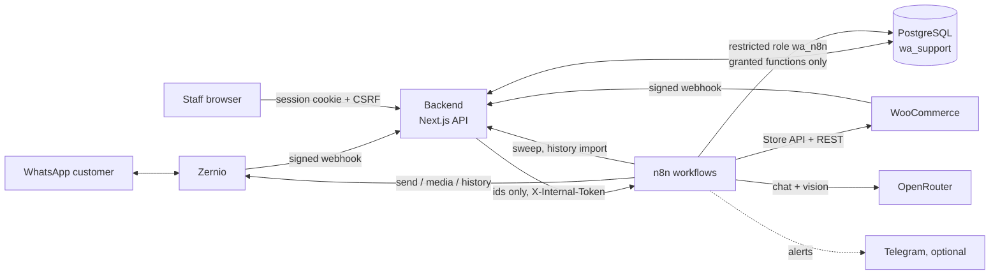

# Architecture

## Components

- **Backend (Next.js, `src/`).** Receives the Zernio and WooCommerce webhooks and verifies their HMAC over the raw body. It stores each event durably, acknowledges it, then normalizes it. It also serves the dashboard and its authenticated API. Every staff action goes through a capability check (`src/lib/permissions.ts`), and the database checks the same capabilities again (`app.require_cap`).
- **PostgreSQL (`db/`).** Schema `app` holds conversations, messages, the outbox, AI jobs, drafts, knowledge, memories, order operations, alerts, audit, metrics and settings. The control rules are SQL functions, for example:
  - `claim_outbound`
  - `record_send_result`
  - `start_ai_job`
  - `submit_ai_result`
  - `takeover`
  - `set_global_controls`
  - `decide_order_operation`

  Because the rules live in the database, the backend and n8n cannot disagree about them.
- **n8n.** Orchestration only. It connects as `wa_n8n`, which can execute only the functions listed in `db/grants.sql` and read a few tables. It holds the provider credentials: Zernio, OpenRouter, WooCommerce and Telegram.

## Workflows

All workflows are generated from `n8n/workflows.mjs`. Instance ids are in `n8n/workflows/ids.json`.

| Workflow | Trigger | Job |
| --- | --- | --- |
| **A Router** | webhook `wa-router` | Routes a stored inbound event: AI job, media download, notification |
| **A2 Media Download** | sub-workflow | Downloads WhatsApp media from Zernio. Checks type and size, stores the file in the database. Fixed host `zernio.com` only |
| **B AI Reply** | webhook `wa-ai-job` | Builds context, calls the chat model with allowlisted tools, validates output, submits it through `submit_ai_result` |
| **B1 Tool Runner** | sub-workflow | Validates tool arguments, then calls E. Order data only after ownership verification |
| **B2 Image Analysis** | sub-workflow | Qwen vision on customer images (base64 data URL, never a public media URL). Structured JSON, stale-job check |
| **C Dispatcher** | webhook `wa-dispatch` + every 15 s | **Single outbound path.** Claims an outbox row (re-checking all controls), uploads the attachment, sends with Idempotency-Key, records the result |
| **D Notifications** | sub-workflow | Telegram alerts (off by default) |
| **E WooCommerce Tools** | sub-workflow | Product search and details (Store API), hosted-checkout links, order status (REST, verified owner only), order-change proposals |
| **F Woo Sync** | webhook `wa-woo-event` + every 6 h | Product and order reference sync, and optional order notifications (off by default) |
| **G Memory** | every 10 min | Conversation summaries and customer memories (redacted) |
| **H Daily Learning** | daily 03:15 | Proposes knowledge updates from resolved chats. Proposals wait for owner approval |
| **I Maintenance** | every minute / 5 min / daily | Backend event sweep, lease expiry, alert forwarding, overdue reminders, media retries, unknown-send reconciliation, retention |
| **J History Import** | manual | Imports earlier Zernio conversation history as historical messages (never answered) |
| **Z Error Handler** | error trigger | Records workflow failures as alerts |

## Message lifecycle

1. **Inbound.** `POST /api/webhooks/zernio`:
   1. The backend verifies the signature, stores the event under a dedupe key, and returns `200`.
   2. It normalizes the event: customer identity, conversation, message, and origin detection for outgoing echoes (own API, Zernio inbox human, WhatsApp Business app).
   3. It calls `wa-router`.
   4. If the call fails, the I sweep retries it within a minute.
2. **Decision.** The router asks the database what to do, based on:
   - the mode: AUTO, COPILOT or HUMAN;
   - the global AI switch;
   - takeover;
   - the burst debounce;
   - business hours.

   AI work starts only through `start_ai_job`, which records `mode_version` and `revision`.
3. **AI reply (B).** The model sees redacted context and has only the allowlisted tools. `submit_ai_result` rejects stale jobs: when the mode, takeover or new customer messages changed since the job started, the result is discarded. The result then goes one of three ways:
   - AUTO: it becomes an outbox row;
   - COPILOT: it becomes a draft for staff;
   - otherwise: it becomes a handoff.
4. **Outbound (C).**
   - All of these become rows in `app.outbound_messages`:
     - AI replies;
     - staff replies;
     - approved drafts;
     - scheduled messages;
     - retries.
   - `claim_outbound` re-checks every control, including the 24-hour window, and takes a lease.
   - A timeout or 5xx result is recorded as **unknown**, never retried blindly. I reconciles it against the provider's message list, or a person decides.
5. **Handoff.** A takeover is an atomic update. Staff replies, handoff phrases, and a human replying from the Zernio inbox or the Business app all switch the conversation to HUMAN. Any AI job still running is then stale and can no longer send.

## Order operations

The AI cannot change orders. It can only record a request with `propose_order_change` (refund, cancellation, address change, renewal or access issue). The order must be verified as belonging to that customer. Staff approve or reject the request in the dashboard, make the change in WooCommerce themselves (refunds go through the payment gateway there), and then record the outcome with **Done in WooCommerce** or **Could not do it**. Purchases use WooCommerce's hosted checkout link for the exact product and variation. Payment status comes only from WooCommerce, never from a customer's claim or screenshot.

## Failure behaviour

- **Database or permission check unavailable:** the claim fails, so nothing is sent.
- **Emergency stop** (`sending_enabled = false`): every claim is refused, including staff messages and order-operation claims.
- **Daily AI budget used up** (`ai_daily_budget_usd`):
  - B hands the conversation to staff and raises one alert per day.
  - Vision, G and H skip their model calls.
- **Model usage missing from a response:** stored as *unavailable*, never as zero.
